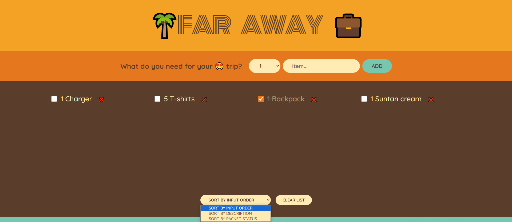

### In this project i practice my React skills.

- How to use useState() and how to lift it.
- How to use filter, map method and spread operator to copy data.
- How to use props and how to set through whole app.
- How to do conditional rendering.
- How to control form elements with useState(). value and onChange events.
- How to sort items.
- How to derive state based on one state condition.

## <h2 align="center">PROJECT OVERVIEW</h2>

