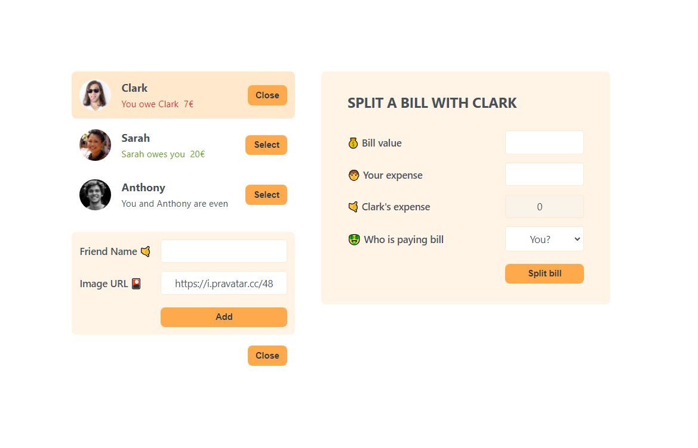
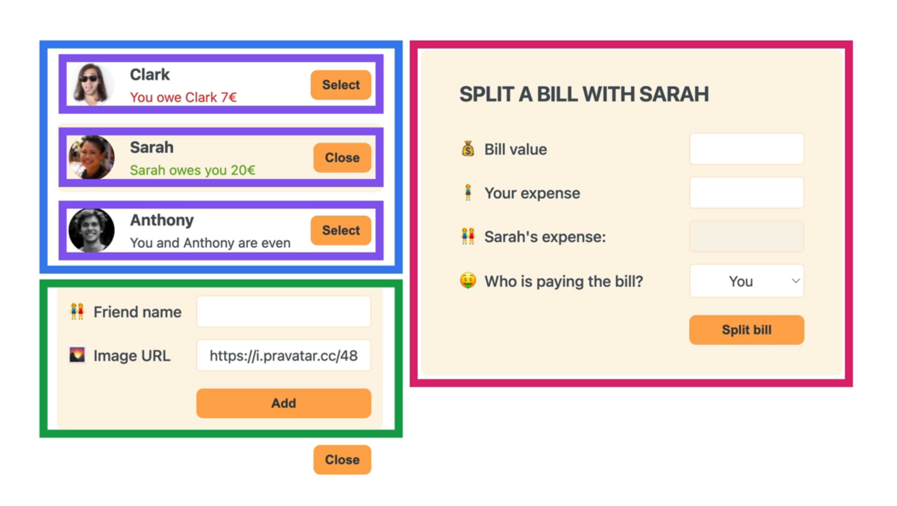

# Eat-N-Split Project.

## What is the main logic in this project ?

It is a project that keeps information about whether you or your friend is a debtor or creditor in case a single person pays the bill for a joint expense you make with your friends.

## Which features i have ?

- I can add new friends to do list with name and image.
- I can select any friend to split any bill.
- I can open and close forms with state.

## Which **React** features i used ?

- useState for control list for friends, to control form elements, and submit events.
- Conditional rendering for forms, button texts, calculated expense and for friend properties.

## Component Tree

